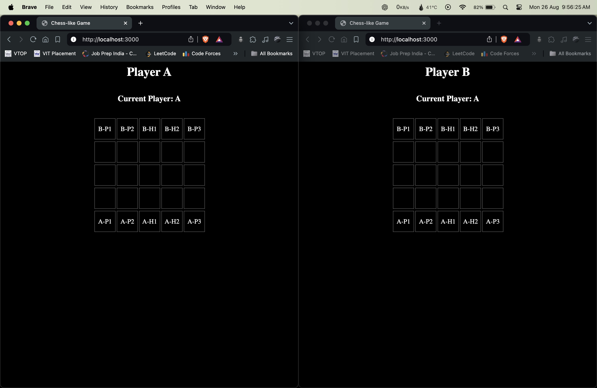
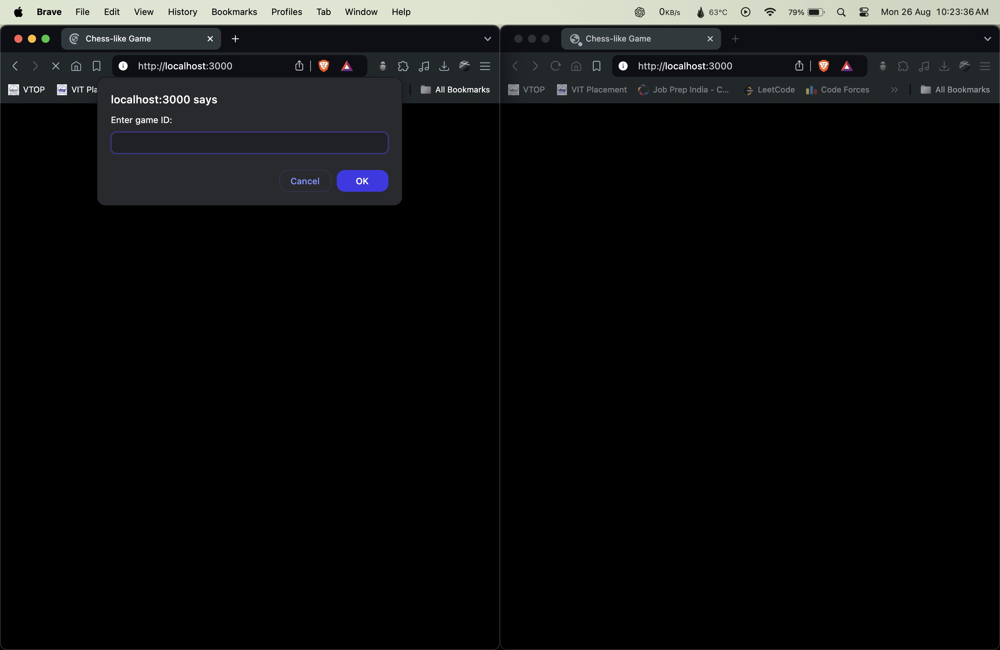
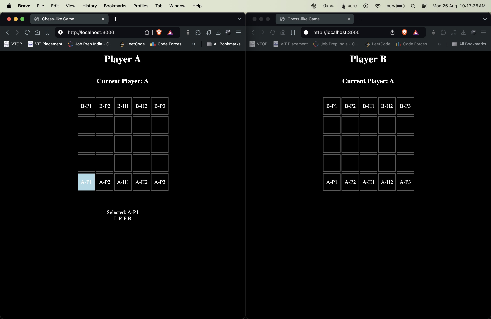
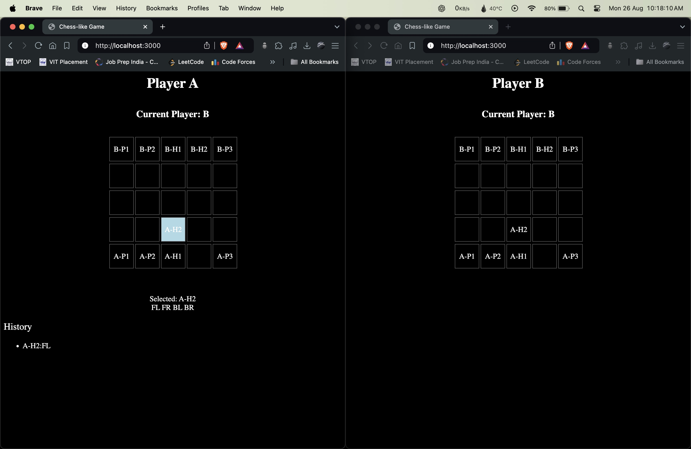
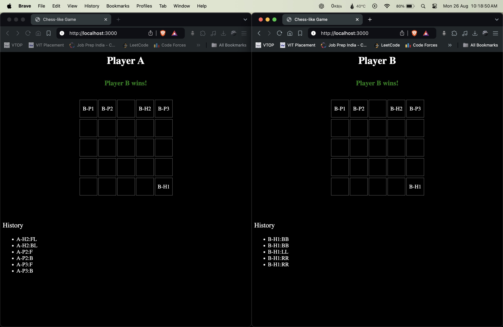

# Turn-based Chess-like Game with Websocket Communication

A turn-based chess-like game with a server-client architecture, utilizing websockets for real-time communication and a web-based user interface.


## Demo
https://github.com/user-attachments/assets/1209ccaa-2052-4cdb-a184-20ed8d5a607a


## Getting Started

### Prerequisites

- Node.js
- npm (Node Package Manager)

### Installation

Prequesites Node and NPM

Git clone

```bash
git clone 
cd Yaswanth_21BIT0564
```

Install required packages

```bash
cd Backend
npm install express http socket.io
```

Run to start backend

```bash
node server.js
```

Open browser and enter the below url to start the game

```bash
http://localhost:3000/
```

Create Game Id (it's up to user)

```bash
213
```

Follow same for but use another browser tab to get started with the game for turn based game


## Output Screenshots

User Interface of the game



Game Id UI



Hover Effect



Moving Hero 2



When Player B wins




## File structure


    ├── Backend                    # Backend Folder
    │   ├── server.js              # Server file
    │   ├── package-lock.json      # Server file
    │   ├── package.json           # Server file
    │
    ├── Frontend                   # Frontend Folder
    │   ├── index.html             # Main Frontend file
    │   ├── game.js                # Javascript file
    │   
    ├── Media                      # Media Folder
    │   ├── Demo_gameplay.mp4      # Demo Gameplay video
    │   ├── User_Interface.jpg     # User Interface picture
    │   ├── Player_B_Wins.jpg      # Player B wins picture
    │   ├── Moving_Hero_2.jpg      # Moving Hero 2 picture
    │   ├── Hover_effect.jpg       # Hover effect picture
    │   ├── Game_Id.jpg            # Game Id UI picture
    └── ...


